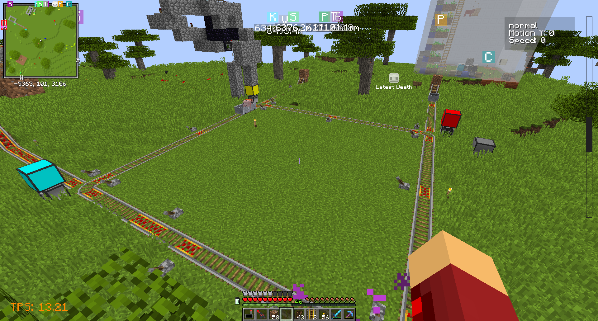
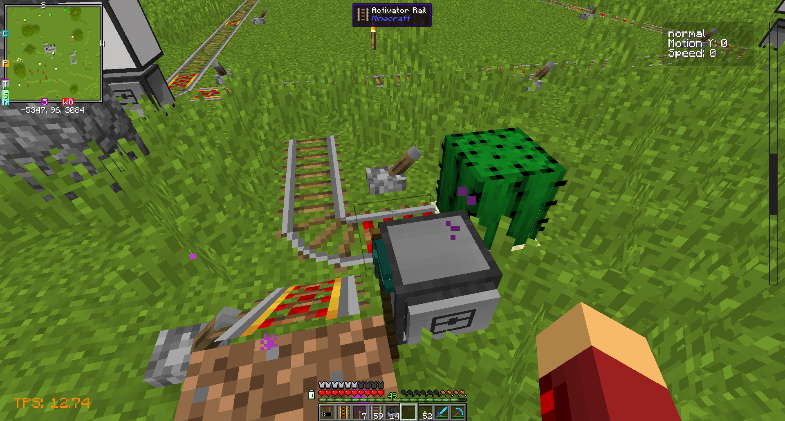

* `arr_controller.py` - Automatically Routed Rail prototype control system. It was set up on a test track on SwitchCraft 2 but not deployed more widely due to a lack of real usecases (instantaneous teleportation made it mostly decorative), some minor issues in cart handling, and some less minor issues in routing multiple users at once.
    * `arr_station.lua` runs on stations and connects to the controller, and `arr_switch.lua` runs on individual redstone switch units.
    * 
    * 
* `chat-ethics-monitor.lua` monitored chat and computed message ethicality using our proprietary algorithms, and incorporated laser defenses against highly unethical messages.
    * `cem2.lua` had a nicer UI but unfortunately no laser defense control authority.
* `es_player_scan.lua` was a system installed in some facilities to report player counts to central metrics processing.
* `ethics-door.lua` was installed in the [Apiaristics Division](https://www.youtube.com/watch?v=EQzYnzDe5uU) and gated access behind sufficiently novel and ethical messages.
* `evil-door.lua` was also part of the Apiaristics Division access control system.
* `flyto_good.lua` is an early design for a neural interface fly-to-coordinates program now incorporated into `ni-ctl`.
* `hacker.lua` prints randomly generated hacker jargon in ominous green text.
* `holo-3dplot.lua` renders graphs on OpenComputers hologram projectors.
* `holoball.lua` is a 3D version of the famous "bouncing ball" screensaver.
* `holoclock2.lua` is a port of a hologram text demo from somewhere to not cause horrible TPS problems. It displays the time.
* I don't know what `holoconstrained.lua` did but it doesn't seem to reveal anything proprietary so it's available.
* `hologram.lua` overlaps several holograms for some kind of rendering thing I forgot. I think in principle you can get many more colours out of this.
* `holo-graph.lua` is a somewhat boring use of a hologram projector to just display a single line.
* `holo-map.lua` used several hologram projectors to display a 3D map of SwitchCraft 2. I didn't have depth data so this was essentially a slightly flickery monitor.
    * The map data was constructed using `stitch_dynmap.py`, `tomapdata.py`, some reslicing process I forgot, and `pngquant`.
* `itemfilter.lua` is a trivial script which just dumps cobblestone from an ender chest and moves other things into a nonender chest.
* `kristdump.py` dumps Krist transactions to a local database for analysis.
* `laser_tbm.lua` was a simple and somewhat problematic script for using a small swarm of laser turtles to dig tunnels. While it was slower than a sheet of nonlaser turtles and produced nonuniform roofs, it was significantly cheaper and enabled the rapid excavation of the several-thousand-block Secret Tunnel Network connecting outer Switch City and the Secret Cheese Facility.
* `matrixrain.lua` - Matrix Rain effect on monitors.
* `mekfr.lua` ran simple controls for a Mekanism fusion reactor and interfaced it with the metrics system.
    * `ncfr.lua` did NuclearCraft reactors and not control.
        * `ncfroc.lua` did control.
* `modem2metrics.lua` was used with `mekfr.lua` and some other systems and bridged ingame modems to the metrics system.
* `motion_integrator_test.lua` was used to test some motion intgeration algorithms to reduce reliance on GPS in `ni-ctl`. Earlier prototypes did not at all work. The addition of `deltaPosX` (clientside rather than serverside velocity, essentially) made it work essentially perfectly.
    * `ni-position-approximator.lua` was an earlier attempt.
* `ni-ctl.lua` is my very overengineered neural interface flight/autodefense/utility program.
    * Due to module count limitations, it could use remote devices (usually (possibly only) lasers) via `ni-ctl_spudnet_interface.lua` and `pocket-offload.lua`.
    * `experimental_3d_pointer.lua` is probably connected in some way.
    * `nilaser.lua` is a very early precursor before it was merged into flight control code and some other things.
* `nnrelay.lua` is used to program OC nanomachines from CC.
* `number-display.lua` probably prints ominous yet meaningless numbers or something.
* `one-way-hallway.lua` controlled the Apiaristics Division's famed one-way hallway.
* `panel-turtle.lua` was used for moderately hidden defensive turtles in Apiaristics Division walls.
* `pgps.lua` is an implementation of ComputerCraft GPS able to operate passively (without transmitting a GPS ping; unlike real-world GNSS, CC GPS requires broadcasts from receivers) using known computers' broadcasts. It did not actually improve on the position solver significantly, which made real-world use somewhat problematic.
* `remote_drone.lua` is an in-development-some-time-ago system for securely controlling OC drones. It interacts with `remote_drone-cc.lua`.
* `retina-scan-door.lua` was used to control access to the Apiaristics Division's Initiative Sigma conference room, with retina scan effects.
* `rimo-door.lua` was for the onsite Records and Information Management Office.
* `sentry.lua` is a laser sentry program which is somewhat safer than standard ones in that it will not fire through protected players to kill mobs.
* `draconic_reactor.lua` controlled a draconic reactor (in combination with some flux gates and a RFTools screen for some auxiliary functions) with remarkably few catastropic explosions.
* `AFLKHASKJFHasuifhasf.lua` provided near-omniscient model monitoring including position fixes using a feed from the VLA (Very Large Array) and onsite trilaterator system.
* `piston-door.lua` was a piston door controller with a nice control panel. For security reasons, the code is entirely ignored and allowances to open handled by another computer nearby with an entity sensor.
* `autonomous-bee-processor.lua` was used as part of an attempt to selectively breed Forestry bees automatically, although it unfortunately proved impractical because of the large amounts of honey consumed scanning every bee.
* `fast-approx-dig.lua` dug out rooms inaccurately but very fast using a turtle, because I was once too lazy to dig a room and also to do a lot of work writing down edge cases in the various loops involved in digging.
* `furnace_controller.lua` is a naive but effective furnace controller program.
* `ore-thing.lua` managed Actually Additions Lens of the Miner systems.
* `spatial_tp.lua` (ab)used Applied Energistics Spatial IO systems and ender chests as teleporters.
* `geiger.lua` was a simple system deployed to monitor NuclearCraft radiation levels using a network of Geiger counters.
* `ae2_metric_exporter.lua` relayed information from an AE2 system to metrics.
* `3dgraph_slave.lua` and `3dgraph_master.lua` are a somewhat janky system for displaying arbitrary inequalities using a large field of blocks managed by command cmputers.
* `apiobotrobot.lua` is a helpful ingame assistant using command computers (for creative servers).
* One of many APIONETs, `apionet.lua` was a rednet-style OC networking system, in the sense that messages were broadcast literally everywhere when they were sent.
* `potatoasm.lua` was apparently a register machine VM.
* `lua-adt.lua` was a project by baidicoot to integrate ADTs into Lua using horrifying regex manipulations for PotatOS Advanced Projects.
* `potatos-obfuscation-tool.lua` was a dubious-quality obfuscator used at one point to obfuscate something.
* `cartdrone.lua` used Computer Minecarts as the CC equivalent of OC drones.
* `oc-gps.lua` was a port of the CC GPS concept to OC.
* `oc-drone.lua` used OC drones to do something or other (pointlessly follow players)? It seems to incorporate GPS. OC has (had) navigation upgrades, but they have a very short range.
* `oc-drone-netboot.lua` was a simple bootloader for OC drones which allowed them to boot directly off the internet to work around codesize limits.
* `oc-remote-wake.lua` was used to get around CC power management issues by using OC computers, which had *different* power management issues.
* `cobble-compressor.lua` produces compressed cobblestone.
* `autokit.lua` used AE2 to automatically provision strongboxes of kit from a defined kit list.
* `basenet.lua` was a simple framework for within-base systems coordination.
* `energraph.lua` monitors RF-holding devices, with no actual graph.
* `pxsign.lua` is an internal potatOS codesigning tool, as is `dcopy.lua`.
* `opus-trilaterator.lua` is an early version of `AFLKHASKJFHasuifhasf.lua`.
* `potatos-chat-monitor.lua` was deployed on SwitchCraft 2 to monitor chat for potatOS-related issues.
* `endermail.lua` used EnderStorage-style ender chests to implement any-to-any remote item transfers.
* `ender-chest-seeker.lua` automatically scanned ES ender chest channels for items.
* `thing-mover.lua` moved items.
* `automelon.lua` ran AutoMelon vending machines.
* `door-internal.lua` and `door-external.lua` comprised a door system with an excellent insult library.
* `oc-robot-name-thing.lua` named computers using OC robot names.
* `web2tape.lua` is an oddly named program to download to Computronics tapes.
* `sgns.lua` changed the design of CC GPS for additional security.
* `rsrn.lua` (Really Slow Redstone Networking) transmitted messages over redstone wires.
* `keyctl.py` managed keys for an early version of SPUDNET HKI.
* `modem-logger.lua` omnisciently moitored network traffic.
* `potatad-config.lua` and `potatoad-extreme.lua` were used to drive advertising displays on SC2.
* `gicr-v2.lua` relayed ingame chat to SPUDNET for reasons now lost to time.
* `thor_laser_unit.lua` was part of a laser defense system on TC6.
* `potatounplex.lua` is a graphics program.
* `potatobox.lua` used PotatOS sandbox technology (which, yes, has some flaws) to sandbox public CC computers.
* `echest.lua` provided chat control over enderchests, but was problematic due to accidentally eating items sometimes.
* `bundlenet.lua` sent messages very slowly over *bundled* redstone.
* `lms.lua` (Lightweight Messaging System) is almost the simplest possible CC chat program, for use on LANs.
* `autocompactron.lua` was used in the automated production of Compact Machines.
* `tomatos.lua` was a design for a more compact and camouflagued version of PotatOS. Thanks to better antidetection methods, TomatOS is believed to run on ██% of currently operating CC computers.
* `rift.lua` controlled Mekanism teleporters.
* `intruder-annoyer.lua` used particle generators to subject unauthorized visitors to CCIM with barrier particles.
* `spatial-control-system.lua` allowed remotely managing spatial IO systems.
* `concrecrafter.lua` automatically produced concrete for Keansian roads.
* `ccss.lua` ran Chorus City street signs.
* `labelnet.lua` transmitted messages over the *labels* of adjacent computers.
* `golboard.lua` displayed Game of Life on something. `golfloor.lua` uses a physical virtual display.
* `demovirus.lua` is a demo virus.
* `p2p-manager.lua` was used to keep track of AE2 P2P tunnels.
* `chatwhy.lua` redirects terminals to chat.
* `ULTRADUMP.lua` was designed to dump literally any Lua object (excluding native handles I guess) to disk. Not finished.
* `arc.lua` was an early implementation of AR for CC overlay glasses.
* `crane.lua` bundles a CC program (and imports) into one file, using filesystem virtualization.

See also [PotatOS](https://potatos.madefor.cc/).